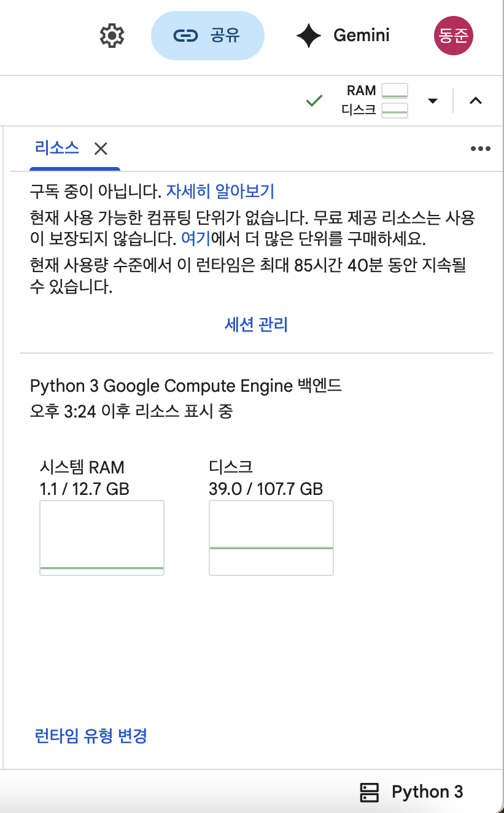
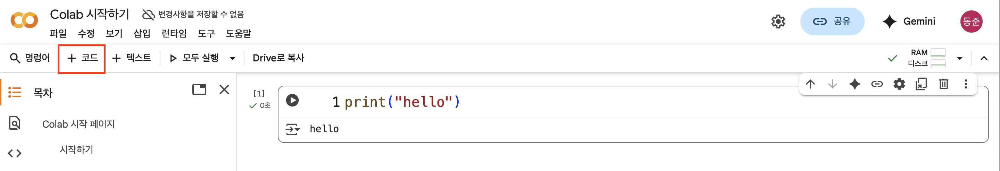
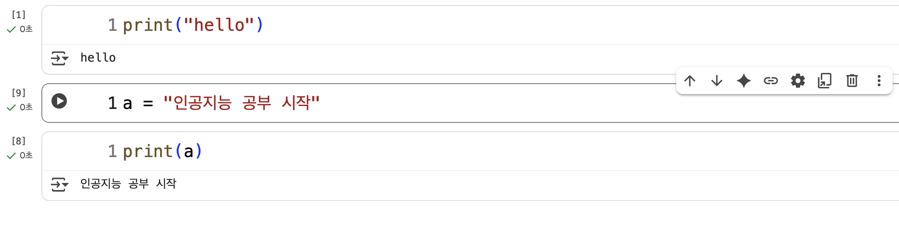
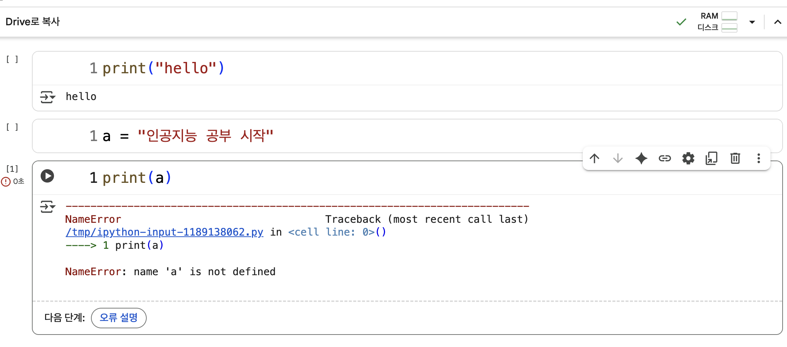

### 코랩
- 무료 GPU 제공
- 일단 난 가난함 ㅠ
- https://colab.research.google.com/

### 리소스 할당
- 동작 원리는 클라우드 환경에서 파이썬 코드 실행

- 이런 식으로 백엔드 연결 가능

### 코드 셀 실행

- 구글 클라우드 컴퓨터 엔진에서 파이썬 코드를 실행
- 즉, 내 로컬과 별개로 프로그래

- 이런 식으로 셀끼리 관여 가능, 단 셀이 실행됐다는 전제하에
- 새롭게 런타임 할당받고(즉, 연결을 끊었다가 다시 하면) 프린팅만 실행하면 당연히 해당 런타임 엔진에 변수 a 정의가 안됐으니까 에러 발생

- **간단하게, 런타임 할당을 최우선하자...라고 일단은 생각하기**