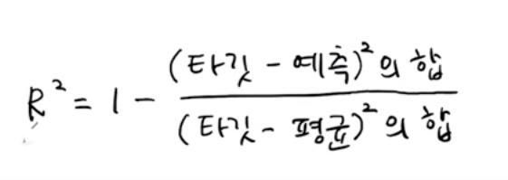

# K-최근접 이웃 회귀 알고리즘
[유툽 강의](https://youtu.be/FaEcLpSZNtg?si=7GqnDMY3BElPuG5-)
### 1. 회귀? 분류?
#### 용어 구분
- 이전까지 공부한 건 K-최근접 이웃 **분류**
- 이번에 공부할 것은 K-최근접 이웃 **회귀**
- AI 분야에서의 회귀의 의미는 **연속적인 수치를 예측하는 모델링 기법**
- 즉, 예측의 대상(출력값)이 **범주(class)** 일 때는 **분류**이고, 예측의 대상(출력값이 **연속값(value)** 일 때는 **회귀**이다.
#### 의미 정리
- 회귀는 값이 평균적 경향으로 되돌아가면서 관계(함수)를 찾아 수치적으로 예측하는 것이 핵심
- 물고기의 (길이, 무게) -> 도미냐 빙어냐 : 분류
- 물고기의 (길이, 무게) -> 나이가 몇살이냐 : 회귀
- 근데 또 이걸 사전적으로 외우려고 하지 말고... 그냥 이런 개념이 있구나 정도로만 이해하기. 왜냐면 뒤에서 공부할 로지스틱 회귀는 회귀 모델이 아닌 분류 모델임(?????)

### 2. K-최근접 이웃

- 알고리즘의 작동 방식은 K-NN 분류와 동일함
- 샘플의 타깃값들을 평균 처리하여 실수값 예측하는 게 일반적(가중치 두거나 그런 방법도 있긴 함)

### 3. 약간의 토막상식
- 타깃 데이터(예측 테스트 데이터)는 1차원 배열(샘플 개수,)이어도 충분함 -> 어차피 정답(클래스나 값)인지 아닌지만 판별하면 되니
- 근데 학습훈련 데이터(입력 데이터)는 무조건 2차원 배열(샘플 개수, 특성 개수)이어야 함 -> 열심히 확실하게 공부해야 되니까
- 아직 와닿지는 않은데, 머신러닝은 패턴을 학습하는 시스템
- 머신러닝의 철학은 어떤 대상(샘플)이 주어졌을 때 그게 속한 그룹이나 결과값(출력)을 보려면, 해당 대상의 여러 측면(특성)을 바라봐야 함
- 헷갈리는 포인트인데, 머신러닝은 **학습훈련 데이터는 '2차원 배열'이어야 하는 거지, 특성이 2개 이상이어야 한다 이건 아님**

### 4. K-NN 회귀 모델의 결정 계수(+ MAE)
- 회귀 모델이기 때문에 정확한 답이 아닌 얼마나 가깝게 맞췄는지가 의미있음
- 사이킷런의 `neighbors.KNeighborsRegressor`가 출력하는 값은 **R^2,** 다른 말로 **R_Square**라는 값. 또 다른 말로 **결정계수**라고 함

- `(타깃 - 예측)^2`은 **잔차 제곱합**이라고 함. 모델의 예측과 실제 타깃의 값의 오차를 계산하므로 값이 작을 수록 예측 적중률이 높다는 뜻
- `(타깃 - 평균)^2`은 **평균 예측 오차**라고 함. 그냥 아무것도 모르는 상태에서 모델의 평균과 실제 타깃의 값의 오차를 계산한 것
- R^2 = 1 : 모델이 완벽하게 예측(잔차가 0이므로)
- R^2 = 0 : 잔차 제곱합(분자)과 평균 예측 오차(분모)가 같음. 즉, 모델이 평균값으로만 예측한 것이므로 단순 평균을 넘는 정보(패턴)를 전혀 활용하지 못한 셈. 모델이 샘플별 패턴을 활용하려 했지만, 결국 아무런 정보도 얻지 못해 평균값만 선택했다
- R^2 < 0 : 얘는... 데이터 군집 내에서 형성된 평균을 벗어난 패턴으로 계산한 거니, 걍 실패한 모델인 셈
- **결정계수는 모델이 학습을 했는지 여부보다는 예측 결과가 평균보다 더 나은가를 보는 상대적인 지표**
- MAE(mean_absolute_error)는 모델 예측이 실제 값과 평균적으로 얼마나 차이나는지 알려주는 절대적인 지표