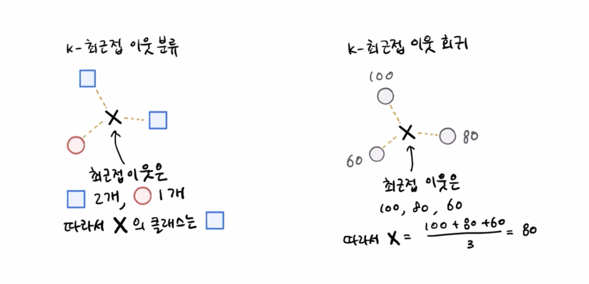

# K-최근접 이웃 회귀 알고리즘
[유툽 강의](https://youtu.be/FaEcLpSZNtg?si=7GqnDMY3BElPuG5-)
### 1. 회귀? 분류?
#### 용어 구분
- 이전까지 공부한 건 K-최근접 이웃 **분류**
- 이번에 공부할 것은 K-최근접 이웃 **회귀**
- AI 분야에서의 회귀의 의미는 **연속적인 수치를 예측하는 모델링 기법**
- 즉, 예측의 대상(출력값)이 **범주(class)** 일 때는 **분류**이고, 예측의 대상(출력값이 **연속값(value)** 일 때는 **회귀**이다.
#### 의미 정리
- 회귀는 값이 평균적 경향으로 되돌아가면서 관계(함수)를 찾아 수치적으로 예측하는 것이 핵심
- 물고기의 (길이, 무게) -> 도미냐 빙어냐 : 분류
- 물고기의 (길이, 무게) -> 나이가 몇살이냐 : 회귀
- 근데 또 이걸 사전적으로 외우려고 하지 말고... 그냥 이런 개념이 있구나 정도로만 이해하기. 왜냐면 뒤에서 공부할 로지스틱 회귀는 회귀 모델이 아닌 분류 모델임(?????)

### 2. K-최근접 이웃

- 알고리즘의 작동 방식은 K-NN 분류와 동일함
- 샘플의 타깃값들을 평균 처리하여 실수값 예측하는 게 일반적(가중치 두거나 그런 방법도 있긴 함)