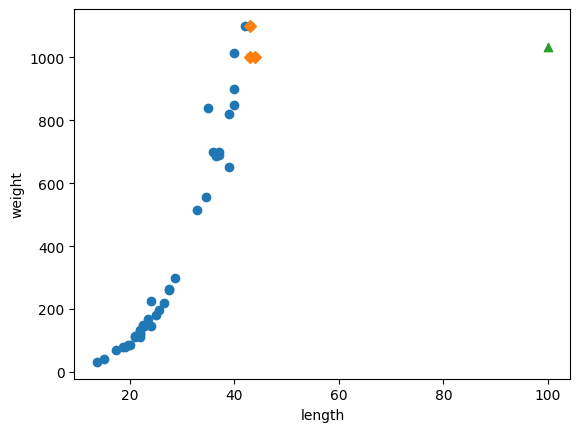
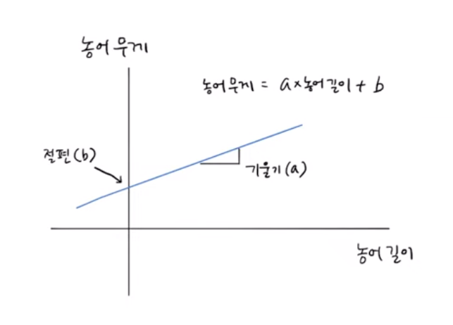
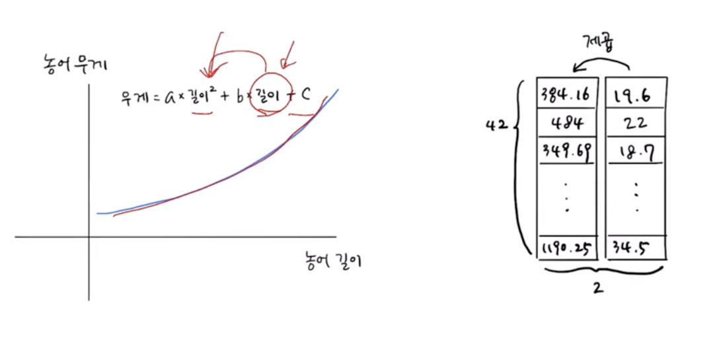

# 선형 회귀
[유툽 강의](https://www.youtube.com/watch?v=ovF9-RqiKA8&list=PLVsNizTWUw7E2RxZ4aspcR9vNamXccmFE&index=8) \
[깃헙 자료](https://github.com/rickiepark/hg-mldl2/blob/main/03-2.ipynb)
### 1. K-NN 회귀 알고리즘의 단점
- **학습훈련용 샘플 범위를 한참 넘어서는 입력의 예측이 어렵다**

- 모델을 훈련할 때 입력했던 학습훈련 데이터의 최대 범위(길이: 44cm, 무게: 1kg)를 넘어서는 길이 입력(100cm)의 무게 예측(1.03kg)이 학습훈련 데이터 범위에 묶이게 됨
- 이 현상을 **외삽(Extrapolation)** 이라고 함
- K-NN 모델은 패턴을 학습하기 보다는 단순히 참조하는 기억 기반 모델이어서 발생
- 훈련 세트가 충분하지 않거나 더 이상 확보가 어려우면 진짜 큰일인 셈...~~(50cm 농어가 안 흔한가..?)~~
### 2. 그래서 공부하는 선형 회귀(Linear Regression)
- 역시나 연속값을 예측하는 회귀 모델
- 선형 방정식 수식의 일반화를 통한 예측, 그러니까 **일반화할 수 있는 직선의 그래프(방정식)를 찾는 것이 선형 회귀의 핵심**
- 사이킷런 모듈의 `sklearn.lenear_model`에 `LinearRegression`으로 존재
- 선형 회귀의 기본 직선 방정식 그래프는 정의역(x축의 길이), 공역(y축) 및 치역(무게)와 기울기, 절편 등이 그대로 쓰임

### 3. 선형 회귀의 한계
- K-NN 회귀 모델과의 평가 스코어링을 비교했을 때, 더 낮게 나옴(간격도 더 벌어지고)
- 직선 그래프는 결국 x축 아래로 떨어질 수밖에 없음. 즉, 길이가 주어졌는데 음수 무게로 예측되는 상황이 나올 수도 있음...
- 이 단점들의 근원은 결국 **직선**이라는 점에 있음. 데이터 경향이 곡선을 나타내는 걸 억지로 직선에 맞추려다보니 생기는 이슈
### 4. 그래서 또 공부하는 다항 회귀(Polynomial Regression)
- 기존 선형 회귀는 `y = ax+b` 꼴이었고, `x`에 대응되는 값 1개만 줘서 `a`와 `b`를 추론하는 것
- 다항 회귀는 `y = ax^2 + bx + c` 꼴에서 `x^2`과 `x`에 대응되는 값을 둘 다 주고 `a`, `b`, `c`를 추론해낸다

- 물론 얘 도입해서 나아진 점도 많지만, 과소적합 이슈가 발생했는데 얘에 대한 해결책은 투비컨티뉴..
