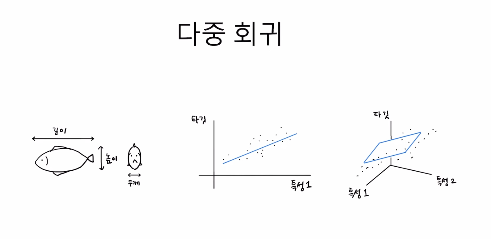

# 특성 공학과 규제
[유툽 강의](https://www.youtube.com/watch?v=TH103jRxHuw&list=PLVsNizTWUw7E2RxZ4aspcR9vNamXccmFE&index=9) \
[깃헙 자료](https://github.com/rickiepark/hg-mldl2/blob/main/03-3.ipynb)

### 1. 다중 회귀
**개념 정리**
- **다항 회귀**랑은 다르다!
- 회귀 모델을 설명할 때, 산점도로 그리기 위해 어쩔 수 없이 특성 한 개만을 써야 했던 단점이 있었음
- 근데, 농어의 길이만으로 무게를 예측하는 것보단.. 농어의 길이랑 높이, 두께 등등 다양한 **여러 개의 특성**을 써서 예측하는 게 뭔가 관념적으로 더 정확할 것 같다는 느낌
- 즉, **다중 회귀는 특성을 여러 개 쓰는 회귀 모델**

- 특성이 여러 개라서 좌표평면이 공간으로 확장될 수 있음
- 특성을 그대로 쓰지 않고, 특성 간 곱한 값 등을 쓰거나 RQ 점수 같은 평가 지표를 활용하는 작업들이 존재한다. 이것을 **피처 엔지니어링(Feature Engineering)** 이라고 한다.
