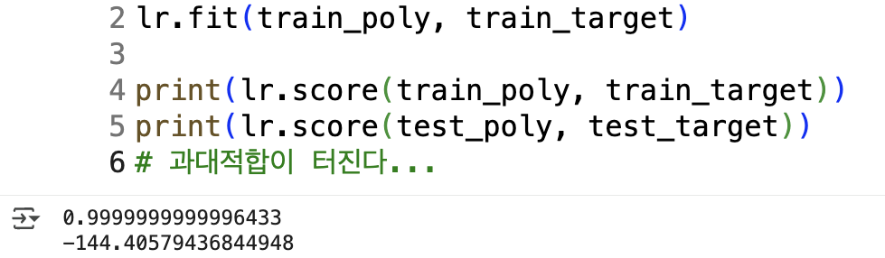
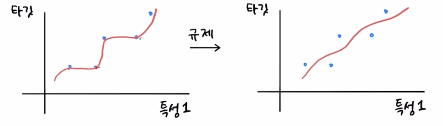

# 특성 공학과 규제
[유툽 강의](https://www.youtube.com/watch?v=TH103jRxHuw&list=PLVsNizTWUw7E2RxZ4aspcR9vNamXccmFE&index=9) \
[깃헙 자료](https://github.com/rickiepark/hg-mldl2/blob/main/03-3.ipynb)

### 1. 다중 회귀
**개념 정리**
- **다항 회귀**랑은 다르다!
- 회귀 모델을 설명할 때, 산점도로 그리기 위해 어쩔 수 없이 특성 한 개만을 써야 했던 단점이 있었음
- 근데, 농어의 길이만으로 무게를 예측하는 것보단.. 농어의 길이랑 높이, 두께 등등 다양한 **여러 개의 특성**을 써서 예측하는 게 뭔가 관념적으로 더 정확할 것 같다는 느낌
- 즉, **다중 회귀는 특성을 여러 개 쓰는 회귀 모델**

- 특성이 여러 개라서 좌표평면이 공간으로 확장될 수 있음
- 특성을 그대로 쓰지 않고, 특성 간 곱한 값 등을 쓰거나 RQ 점수 같은 평가 지표를 활용하는 작업들이 존재한다. 이것을 **피처 엔지니어링(Feature Engineering)** 이라고 한다.

**코드 실습 자료**
- [넘파이 자료](https://ml-ko.kr/homl2/tools_numpy.html)와 [판다스 자료](https://ml-ko.kr/homl2/tools_pandas.html) 참조해보기
- 실제로 `sklearn`의 `preprocessing` 모듈의 `PolynomialFeatures` 클래스를 활용하니 특성 조합이 다양해지고 지난 시간의 과소적합 이슈도 극복된 게 보였음
- **그럼 특성이 많을수록(조합이 다양해질수록) 좋은 걸까...?**
### 2. 무조건 특성 조합이 많아진다고 좋은 게 아니다
- `degree`를 높이고 `transform`하면 이항계수에 따라 다양한 특성 조합이 나오게 될 것
- 실제로 테스트해보면, 테스트 스코어링이 형편없이 낮은 과대적합 이슈가 발생함

- 항이 높아지면, 곡선의 정도(자유도)가 마구잡이로 높아짐(1차함수 -> 2차함수 -> 3차함수 -> 4차함수...)
- 이 말은 곧, 선이 요동치면서 훈련 데이터를 완벽하게 맞출 수 있게 된다는 거임
- 근데, 문제는.. 어느 지점에서 곡률이 발생한다고 모델이 '과잉해석'을 하게 됨
- 이 지점에서는 무조건 미분값이 아래다(급강하한다) 이런 식으로...
- **유사한 특성 값들에 대해, 예측값이 훈련 세트와 테스트 세트가 다른데, 훈련 세트만 맹신해서 테스트 세트도 훈련 세트처럼 예측해버림**
- 그래서 테스트 스코어링이 -144점이라는 형편없는 과대적합 이슈가 발생한 것
### 3. 규제의 필요성
- 특성 개수가 많을 때, 모델이 과하게 훈련하지 않도록 해야 함. 이것이 **규제**
- 선형 계수에서는 **기울기(가중치)를 작게 만드는 것**이 규제

- 물론 특성의 스케일이 각 특성별로 들쭉날쭉하면 안 되므로 스케일을 같게 맞추는 작업이 필요한데, 그 대표적인 게 **표준화**
- 평균값을 0으로 만들고 표준편차를 1 근처에서 퍼지게 하는 정규분포화를 활용해서 표준화한다
### 4. 릿지와 라쏘
- 릿지(Ridge)와 라쏘(Lasso)는 규제의 종류(L2/L1)이자, 그걸 적용한 규제 선형 회귀 모델을 의미함
- 수학적인 작동 매커니즘은 선형대수학 공부해야 될듯... 나중에 좀 더 깊게 파보고 지금은 방법론적 개념으로만 체득하기

**릿지(Ridge)**
- **특성의 가중치(기울기)가 너무 커지지 않도록 제어**하는 선형 회귀 모델
- 손실 함수에 가중치 제곱(L2 규제) 항을 추가해 큰 계수(기울기)를 억제하는 게 포인트
- 즉, **큰 가중치는 패널티를 받게 함**
- 모든 특성의 영향력을 완전히 없애진 않고, 큰 가중치를 부드럽게 해서 모델을 최대한 일반화시킴