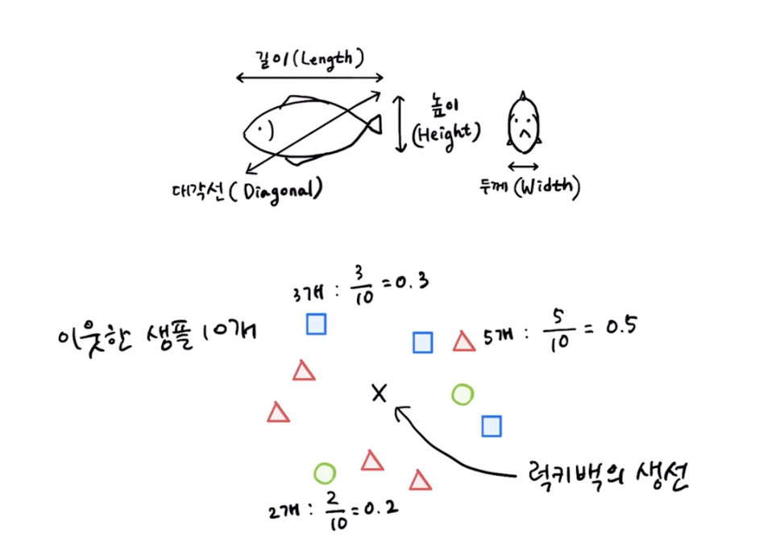
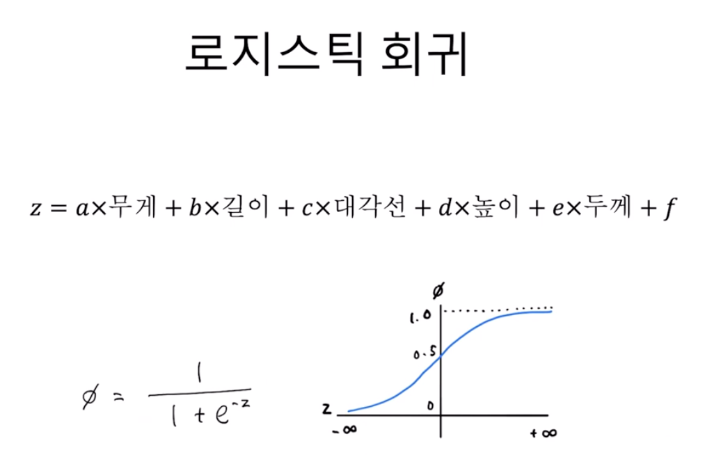

# 로지스틱 회귀
[유툽 강의](https://www.youtube.com/watch?v=eZoXnkQ_l4w&list=PLVsNizTWUw7E2RxZ4aspcR9vNamXccmFE&index=10) \
[깃헙 자료](https://github.com/rickiepark/hg-mldl2/blob/main/04-1.ipynb)

### 1. 개요
- 지난 시간까지 도미와 빙어를 잘 분류하고 농어 사이즈를 회귀(예측)하고... 했음
- 이번에는 이 수산물을 판매하려고 하는데, 그냥 파는 것이 아닌 **불투명한 포장으로 감싸 팔고 내용물은 안 알려주는 것임**. 즉, 판매를 **랜덤박스**처럼 하는 셈
- 근데 그냥 판매하면 당연히 쌍욕먹을 테니... **특정 랜덤박스 안에 든 물고기들 확률 알려주기**를 할 예정

### 2. K 최근접 이웃과의 비교
- 만약 위의 상황을 K-NN으로 처리한다면, **랜덤박스의 주변에 있는 상품들 클래스 개수를 세려서 확률을 각 상품별로 연산**할 수 있을 것

- 근데 이 방식의 문제점은, **샘플 벡터 위치가 조금이라도 변동되면 그 확률이 크게 변한다는 것**임
- 또한, **클래스가 증감하는 경우에 대해 확률이 너무 급격하게 튐**
- 샘플 벡터 위치 변경에 따른 확률 변동은 필연적이지만, 그 과정이 **비연속적이고 비논리적**이라는 점이 문제

### 3. 로지스틱 회귀 개념

- 로지스틱 회귀는 **선형 결합을 계산하고, 시그모이드 함수를 적용해 예측을 결정**한다.

**선형 결합 단계**
- `z=a⋅무게+b⋅길이+c⋅대각선+d⋅높이+e⋅두께+f`처럼 선형 회귀의 선형방정식을 활용하게 됨(이 과정이 **선형 결합**)
- 선형방정식의 각 계수(`a, b, c, d, e, f`)를 학습을 통해 모델 파라미터(가중치 + 편향)로써 결정, 입력 특징들을 대입해 선형 결합하여 `z` 연산
- 이를 통해 나오는 `z`는 선형 회귀였다면 타겟값이 되겠지만, 로지스틱 회귀는 분류 모델이고 확률을 에측해야 되니 아직은 수치에 불과

**시그모이드 함수 적용 단계**
- 연산된 `z`는 **시그모이드 함수**에서 활용됨
- `σ(z) = 1 / (1 + e^(-z))`에 적용해서 나온 치역의 범위는 0에서 1 사이. 즉, **확률**이 됨
- 기준은 보통 `σ(z) = 0.5`로 두고 그보다 작으면 음성 클래스, 크면 양성 클래스로 생각

### 4. K 최근접 이웃 대비 로지스틱 회귀의 의의
- 앞서 말했듯, 샘플의 벡터 변동에 따른 확률 예측 변화는 필연적임
- 하지만 KNN은 그 변동 과정이 비논리적이고 비연속적이지만, 이를 **전역적으로 파라미터를 학습하고 전체 데이터 기반 함수를 통해 확률을 연속적이고 일관되게 계산**하는 것이 로지스틱 회귀의 의의. 즉, 확률 연산의 당위성이 확보됨

**다중 클래스일 경우**
- 이진 분류일 경우에는 현재의 시그모이드 함수를 그대로 적용해도 됨
- 클래스가 3개 이상이면 각 클래스 확률을 동시에 계산해야 돼서 **소프트맥스 함수**(`P(y=c | x) = exp(z_c) / Σ_j exp(z_j)`)를 적용해야 함